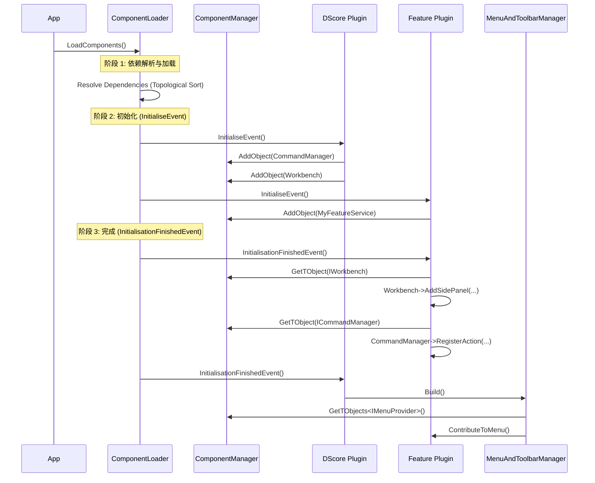
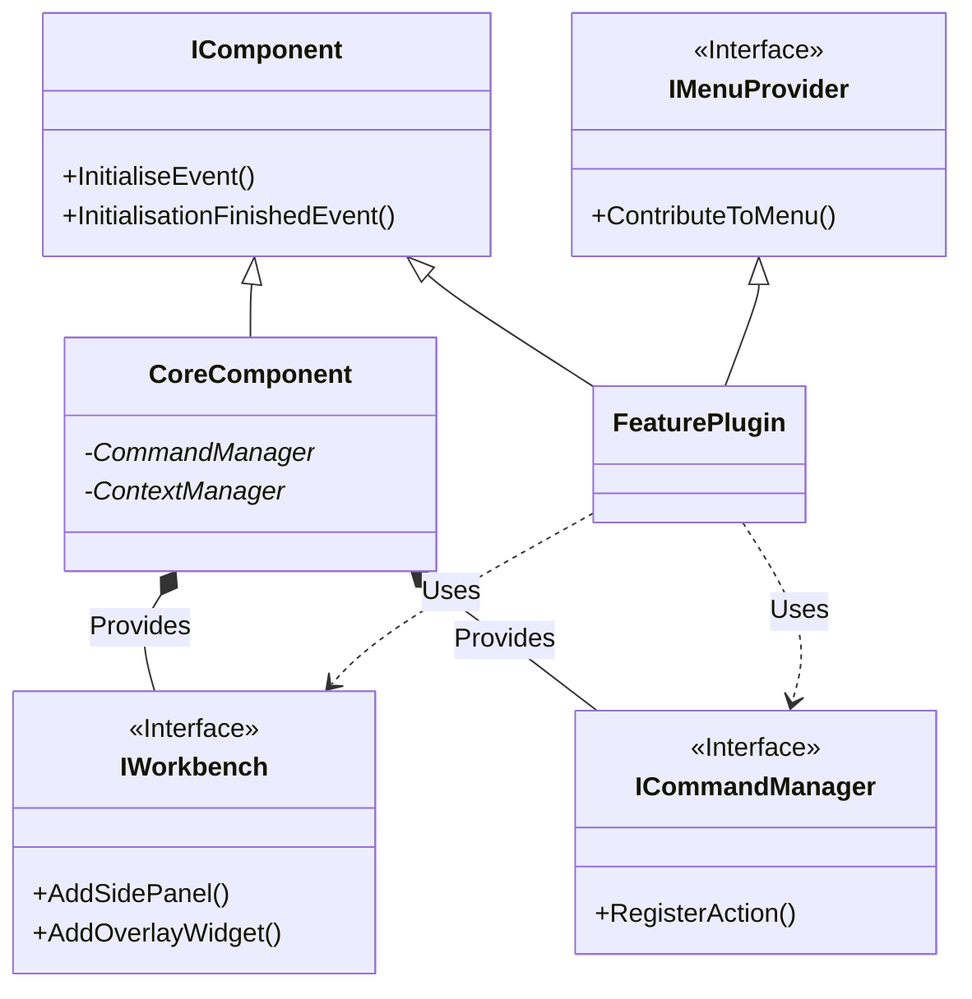

# 核心架构详细设计文档

**项目名称**: PlugDS (Plugin-based DefinSight)
**日期**: 2025-12-05
**模块**: extsystem & dscore

---

## 1. 架构总览 (Architecture Overview)

本项目采用了严格的 **Shim + Plugins (微内核)** 架构模式。

* **Shim (Executable)**: 一个极小的宿主程序，不包含任何业务逻辑。它的唯一职责是启动 `ComponentLoader`。
* **ExtSystem (Infrastructure)**: 定义了插件系统的物理法则。它负责发现动态链接库、解析依赖图谱、管理生命周期以及提供全局的服务注册表。
* **DScore (Application Shell)**: 应用程序的"根插件"。它构建了主界面框架（菜单、工具栏、工作区），并提供了开发 GUI 应用所需的通用服务（命令系统、上下文系统）。
* **Business Plugins**: 具体的功能模块（如工作区、数据、设备管理等），它们依赖 `ExtSystem` 进行注册，依赖 `DScore` 进行界面呈现。

---

## 2. 模块详解：ExtSystem (Extension System)

`extsystem` 是底层基础设施，它不依赖 Qt 以外的任何库。

### 2.1 核心文件深度解析

#### `IComponent.h` (接口契约)

这是所有插件的基类。它定义了严格的两阶段初始化生命周期，解决了插件间的循环依赖和服务获取时机问题。

* **`InitialiseEvent()`**: **注册阶段**。
  * **时机**: 按依赖顺序（被依赖者先执行）。
  * **职责**: 插件**必须**在此阶段实例化自己的服务，并调用 `AddObject` 注册到全局管理器。
  * **禁忌**: **严禁**在此阶段去获取其他插件的服务（因为其他插件可能还没运行到这一步）。
* **`InitialisationFinishedEvent()`**: **组装阶段**。
  * **时机**: 按依赖顺序的逆序（依赖者先执行）。
  * **职责**: 此时所有插件都已完成注册。插件在此阶段调用 `GetTObject` 获取其他服务（如 `dscore` 的 `IWorkbench`），并构建 UI、连接信号槽。
* **`FinaliseEvent()`**: **清理阶段**。
  * **职责**: 保存状态、断开连接、注销服务。

#### `IComponentManager.h` (服务定位器)

实现了 **Service Locator** 模式，充当全局的“交换机”。

* **`AddObject(QObject*)`**: 插件将自己提供的服务（通常是 Manager 类或 Service 类）放入池中。
* **`GetTObject<T>()`**: 类型安全的服务获取接口。
* **设计意义**: 解耦了具体的插件类。Plugin A 不需要 `#include "PluginB.h"`，只需要包含 Plugin B 的接口头文件，通过 Manager 获取实例。

#### `ComponentLoader.h` (加载引擎)

这是插件系统的引擎。

* **`AddComponents`**: 扫描指定目录下的 `.dll`/`.so` 文件。
* **`resolve`**: **依赖解析算法**。
  * 读取每个插件 `metadata.json` 中的 `dependencies` 字段。
  * 构建有向无环图 (DAG)。
  * 执行拓扑排序，计算出正确的加载顺序列表 (`load_order_`)。
* **错误处理**: 能够检测循环依赖、版本不兼容或缺失依赖，并设置相应的 `LoadFlag`。

---

## 3. 模块详解：DScore (DeepSight Core)

`dscore` 是应用层的核心，它实现了 `extsystem` 定义的组件接口，并作为所有 UI 插件的上层依赖。

### 3.1 核心文件深度解析

#### `CoreComponent.h` (插件入口)

* **职责**: `dscore` 模块的引导类。
* **实现**:
  * 在 `InitialiseEvent` 中：创建 `CommandManager`、`ContextManager`、`MenuAndToolbarManager` 等核心服务，并注册到 `extsystem`。
  * 在 `InitialisationFinishedEvent` 中：调用 `MenuAndToolbarManager::Build()`，触发最终的 UI 组装。

#### `ICommandManager.h` & `CommandManager.cpp` (命令系统)

这是架构中最关键的解耦机制，它将“用户操作”（Action）与“触发方式”（Button/Menu）分离。

* **`RegisterAction`**: 注册一个全局唯一的命令 ID（如 `"file.save"`）。
* **Context Awareness (上下文感知)**:
  * 命令可以绑定 `visibility_contexts` (可见性上下文) 和 `enabled_contexts` (启用上下文)。
  * **示例**: 保存按钮只在 `kEditorActive` 上下文激活时才变为可用状态。
* **设计意义**: 插件开发者不需要手动去 `setEnabled(true/false)` 按钮，只需维护上下文状态，UI 会自动响应。

#### `IWorkbench.h` (UI 扩展点)

定义了主窗口布局的抽象接口，防止业务插件直接依赖 `QMainWindow`。

* **`AddSidePanel`**: 添加侧边栏（如资源管理器）。
* **`AddOverlayWidget`**: 添加覆盖层（如全屏加载动画、HUD）。
* **`AddSqueezeWidget`**: 添加挤压层（如顶部的消息横幅）。
* **使用方式**: 业务插件在 `InitialisationFinishedEvent` 中获取 `IWorkbench` 接口并调用这些方法。

#### `MenuAndToolbarManager.h` (UI 组装器)

实现了 **Builder** 模式的变体。

* **机制**: 它不通过硬编码创建菜单。而是遍历系统中所有实现了 `IMenuProvider` 和 `IToolbarProvider` 接口的对象。
* **`Build()`**:
    1. 查找所有 Provider。
    2. 调用 `provider->ContributeToMenu(commandManager)`。
    3. 根据 Provider 定义的路径（如 `"View/Panels"`）将命令插入到正确位置。

#### `IContextManager.h` (状态管理)

* **职责**: 维护应用程序当前的“状态集合”。
* **工作流**:
    1. 业务插件进入某种模式，调用 `ContextManager::AddContext(kMyModeId)`。
    2. `ContextManager` 发出信号。
    3. `CommandManager` 捕获信号，遍历所有 Action，检查它们是否符合当前上下文集合，自动更新 UI 的 Enable/Visible 状态。

---

## 4. 架构图示 (Visualizing the Architecture)

### 4.1 模块依赖关系图

```mermaid
graph TD
    %% 定义样式
    classDef infrastructure fill:#f9f,stroke:#333,stroke-width:2px;
    classDef core fill:#bbf,stroke:#333,stroke-width:2px;
    classDef plugin fill:#dfd,stroke:#333,stroke-width:2px;

    subgraph "Infrastructure (基础层)"
        ExtSystem[ExtSystem<br/>(Loader, Registry, IComponent)]:::infrastructure
    end

    subgraph "Core (核心层)"
        DScore[DScore<br/>(MainWindow, Managers, Workbench)]:::core
        DScore -->|Implements| ExtSystem
    end

    subgraph "Plugins (业务层)"
        PluginA[Analysis Plugin]:::plugin
        PluginB[Visual Plugin]:::plugin
        
        PluginA -->|Depends on| DScore
        PluginB -->|Depends on| DScore
        PluginA -->|Registers| ExtSystem
        PluginB -->|Registers| ExtSystem
    end
```

### 4.2 运行时序图：启动与UI构建



### 4.3 类图：主要接口关系



---

## 5. 开发规范与制约 (Development Guidelines)

在后续开发新插件时，必须遵循以下规范：

### 5.1 必须遵守 (Must Do)

1. **接口优先**: 跨插件通信必须定义纯虚类接口（Header-only interface），放在 `include/<module>/` 下。实现细节放在 `src/` 下，不要暴露。
2. **正确的生命周期**:
    * **服务生产**放在 `InitialiseEvent`。
    * **服务消费**和**UI构建**放在 `InitialisationFinishedEvent`。
3. **使用 Core 服务**: 所有的菜单项必须通过 `IMenuProvider` 添加，所有的全局操作必须注册到 `CommandManager`。严禁使用 Qt 原生 API (如 `menuBar()->addAction()`) 修改主窗口结构。
4. **Context 管理**: 不要手动 enable/disable 按钮。创建适当的 Context ID，在业务逻辑中激活/停用 Context，让 `CommandManager` 自动处理 UI 状态。

### 5.2 严禁行为 (Don't Do)

1. **禁止循环依赖**: A 插件依赖 B，B 又依赖 A。这会导致加载器报错。如果发生这种情况，说明需要提取一个公共接口层（Base Interface）。
2. **禁止直接强转**: 不要使用 `qobject_cast` 强转 `dscore` 的具体类。只能使用 `IWorkbench` 或 `ICore` 等接口。
3. **禁止单例滥用**: 虽然 `ComponentManager` 是单例，但插件内部的业务类应尽量避免单例，而是通过依赖注入或 `ComponentManager` 进行管理。

### 5.3 命名约定

* **插件类名**: `CamelCase` (e.g., `WaveformComponent`).
* **接口类名**: 以 `I` 开头 (e.g., `IDataProvider`).
* **命名空间**: `sss::<module_name>` (e.g., `sss::dscore`).
